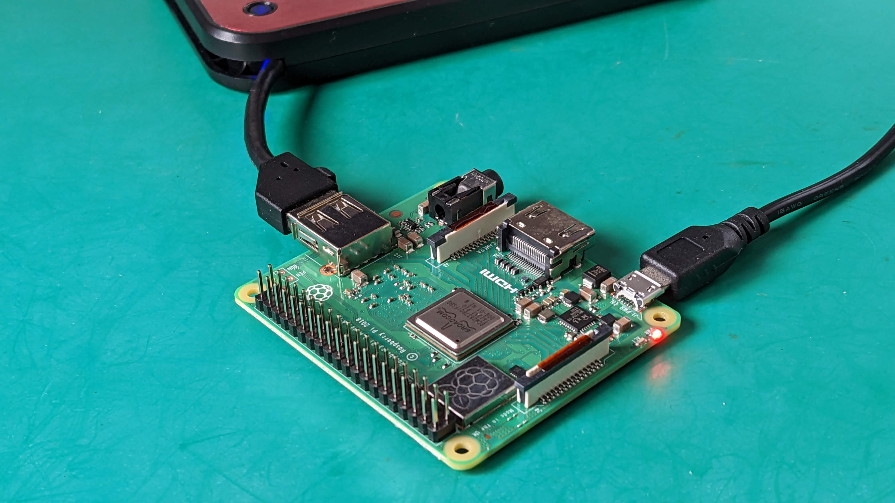
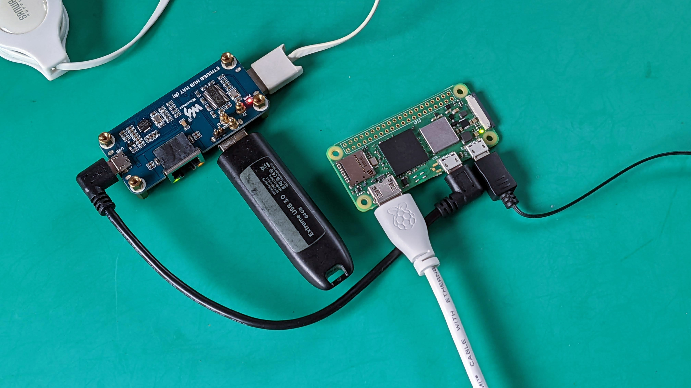

# cloud-init-raspi
Raspberry Pi 3/Zero 2上でUSB SSDからUbuntu Serverをブート可能に設定する。

# 概要
RasPi 3/Zero 2 Wは工場出荷状態ではUSBホストブートができない。これはUSB SSDからブートできないことを意味する。

そこでRasPi 3/Zero 2 WをUSBホストブート可能になるよう設定し、Cloud-Initを使ってOSを設定する。
OSはUbuntu Server 22.04 LTSを使う。また、ユーザーはSSH経由でログインするものとする。
パスワードは使わず、SSHの公開キーはgithubから取得する。このためネットワーク接続が必須である。

なお、以下の説明で「ホストPC」とは、RasPi Imagerを実行するPCのことをさす。
## 機能
- USB SSDからブート可能
- Ubuntu Server 22.04 LTS
- Wi-Fi の設定
- [Waveshare ETH/USB HUB HAT(B)](https://www.waveshare.com/wiki/ETH/USB_HUB_HAT_(B))のEthernetを使えるようにする
- ローカルネットから *hostname*.localnet としてアクセスできるようにする。
- スワップファイルを作成する

## 使い方
以下のステップで設定を行う。
1. RasPi 3/Zero 2をUSBホストブート可能にする
2. USB SSDのUbuntu ServerのCloud-Initを設定する
3. USB SSDからブートして設定する
3. Ethernetを設定する

USBホストブートを行うためには、USB SSDを接続するUSBハブが必要である。ハブにはETH/USB HUB HAT(B)を使っている。


# RasPi 3/Zero 2をUSBホストブート可能にする
RasPi 3/Zero 2は工場出荷状態ではUSBホストブートができない。そこで最初に[RasPi 3/Zero 2をUSBホストブート可能にする](https://www.raspberrypi.com/documentation/computers/raspberry-pi.html#raspberry-pi-2b-3a-3b-cm3-cm3-zero-2-w)。

まず、[RasPi Imager](https://www.raspberrypi.com/software/)を使って、SDカードにOSのイメージを焼く。
OSにはUbuntu Serverを使う。OSを焼いたら、SDカードをホストPCからいったん抜いて挿しなおしたあとに設定ファイルの編集を行う。いったん抜くのはRasPi Imagerによるパーティション変更をWindowsに認識させるためである。

編集するファイルはSDカードのconfig.txtである。このファイルの最後に次の1行を追加する。

```
program_usb_boot_mode=1
```
この設定があると、RasPiはブート時にEEPROMを書き直し、USBホストブート可能にする。
ブート開始から作業の完了まで30秒程度であるので、すぐにシャットダウンしてよい。
心配ならば電源投入から5分ほど放置しておく。なお、このSDカードのシステムは以降使わないので、シャットダウンせずに電源を抜いても良い。

USBホストブート可能になったらSDカードは不要なので抜いておく。

なお、この変更は不可逆操作である。一度USBホストブート可能にすると二度とホストブート
不能に戻すことはできない。

# cloud-initのカスタム化

[Cloud-Init](https://cloudinit.readthedocs.io/en/latest/)はその名の通りクラウド上のインスタンスの初期設定のための機能であるが、RasPi Imagerはこの機能を使って各種の設定を行っている。

Cloud-Initを使うには、このリポジトリから次の二つのファイルをダウンロードして、RasPi Imagerが書き込んだファイルを上書きする。
- [user-data](user-data)
- [network-config](network-config)

利用に先立ってこれらのファイルのカスタム化を行わねばならない。

## user-data
|設定     | キー          | デフォルト値            | 備考　|
|---------|--------------|------------------------|-------|
|ホスト名| hostname       | ubuntu                 | Ubuntu Serverのホスト名|
|ユーザー名| name         | your-user-name         | 構成するサーバーに作るユーザー名|
|SSHキー  | ssh_import_id | gh:your-github-account | "gh:"でgithubのアカウントからSSHの公開建を取得することを指定する|

**ホスト名**はRasPi上のUbuntuの名前である。この名前をfooとすると、RasPiをローカルネットワークからfoo.localとしてアクセスできる。ホスト名にはLinuxのホスト名として正しい文字列なら何を指定しても構わない。ただし、ローカルネットワークの他のホストと違う名前にしなければならない。

ホスト名をfooにするには、user-dataの"hostname:"行を以下のように変更する。
```yaml
hostname: foo
```
**ユーザー名**はUbuntu Serverにログインする際のユーザー名である。ここにはLinuxのユーザー名として正しい文字列なら何を指定しても構わない。

ユーザー名をbarにするには、user-dataの"users:"以下を次のように変更する。
```yaml
users:
- name: bar
```

**SSHキー**は[GitHubのAPI](https://github.blog/changelog/2022-01-18-githubs-ssh-host-keys-are-now-published-in-the-api/)を通してユーザー・アカウントから取得している。GitHubのユーザー・アカウントがbazの時、user-dataの"ssh_import_id:"以下を次のように変更する。
```yaml
  ssh_import_id:
    - gh:baz
```
なお、SSHキーをGitHubから取得したくない場合は、以下のように直接公開建を書くこともできる。以下の例は[cloud-initのリファレンス](https://cloudinit.readthedocs.io/en/latest/topics/modules.html#host-keys)に掲載されている例である。
```yaml
ssh_authorized_keys:
  - ssh-rsa AAAAB3NzaC1yc2EAAAABIwAAAGEA3FSyQwBI6Z+nCSjUU ...
  - ssh-rsa AAAAB3NzaC1yc2EAAAABIwAAAQEA3I7VUf2l5gSn5uavROsc5HRDpZ ...
```


## network-config
|設定      | キー          | デフォルト値    | 備考　|
|----------|--------------|----------------|-|
|SSID      |access-points |your-ap-ssid    |アクセスポイントのSSID|
|パスワード |password      |your-ap-password|アクセスポイントのパスワード|

Wi-Fiの設定はnetwork-configファイルで行う。この"access-points:" 以下にWi-FiのSSIDとパスワードを書く。"your-wifi-ssid"を自分のWi-FiアクセスポイントのSSIDに書き換え、"your-wifi-password"を自分のWi-Fiアクセスポイントのパスワードに置き換える。
```yaml
    access-points:
        "your-wifi-ssid":
            password: "your-wifi-password"
```
パスワードは平文で書いても、wpa_passphraseでハッシュ化したパスワードを書いてもよい。後者の方が安全に感じるが、これは錯覚である。ハッシュ化パスワードもパスワードであることに変わりないので、外部に漏洩すればやすやすと侵入される。

インストールすべきすべてのデバイスへのインストールが終わったら、SDカード上のnetwork-configファイルは乱数で塗りつぶすなどの処置をおこなったあとに削除すべきである。


# USB SSDのUbuntu ServerのCloud-Initを設定する
次にUSB SSDにRasPi Imagerを使って目的のOSを焼く。この解説ではUbuntu Server 22.04がターゲットである。

このとき、RasPi Imagerの*Advanced Option*は使わないように気を付ける。この機能はRasPi OSでしか試験されておらず、2022年の時点では、場合によっては[ブート時にスクリーンがブラックアウト](https://GitHub.com/raspberrypi/rpi-imager/issues/286#issuecomment-974020447)することが知られている。

RasPi ImagerでOSイメージを焼き終わったら、ホストPCからSSDを抜いて挿しなおした後、user-dataとnetwork-configを上述のカスタム化したファイルで上書きする。

# USB SSDからのブート後
user-dataとnetwork-configの準備ができたらUSB SSDをホスト・コンピュータから取り外し、RasPiに接続して起動する。

log-inプロンプトが表示されても何もしなくてよい。

起動後、Cloud-Initがuser-dataとnetowork-configに基づいた設定を行う。この設定にはaptによるプログラム更新も含まれており、長ければ数十分かかるかもしれない。

すべての設定と更新が終了するとシステムは自動的に再起動する。

この時点で、Wi-Fiはアクセスポイントに接続できており、SSHによるログインが可能になっている。もしSSHによるログインができないならば、user-dataとnetwork-configの設定を見直す。

# 有線LANのデバイス名を設定する

（以下の設定は有線LANが無ければ不要である）

SSHでの接続が可能であれば、最後にEthernetの設定を行う。Waveshare ETH/USB HUB HAT(B)はRTL8152 Ethernetチップを搭載している。Cloud-Initによる設定によって、このチップは自動的にEthernetとして認識される。

なお、cloud-initはRTL8152の設定を行うが、この設定が有効になるのは再起動後である。
cloud-init内部でRTL8152を使った通信はできないので注意すること。

Ethernetデバイスの名前は以下のコマンドで確認できる。

```sh
ip link
```
Ubuntu Server 22.04ではネットワークデバイスのカーネル名はenxXXXXXXXXXXXX（xは16進数）となっており、覚えにくい。

これをeth0に変更するため、/etc/netplan/99-eth-usb-hub-hat-b-config.yamlの"eth0:"以下を次のように書き換える。

```yaml
eth0:
    match:
        macaddress: "00:00:5e:00:53:00"  # Change to your MAC address

```
ここで"macaddress:"に続くのは、EthernetデバイスのMACアドレスである。MACアドレスは上記 ip link コマンドによって表示されたものを使う。
この変更をほどこしてシステムを再起動すると、Ethernetデバイスの名前はeth0になっている。

# 解説
## aptの実行
Cloud-Initではインスタンスの初期化時にapt upgradeまで実行することができる。
```yaml
package_update: true
package_upgrade: true
```
しかし、このリポジトリの設定ではapt updateのみ行う設定にしている。これは、RasPi 3/Zero 2 Wのメモリが512MBしかないためである。Ubuntu Server 22.04でapt upgradeを初期化後に行うと512MBのメモリではオーバーフロー・エラーが起きる。

これを避けるためにCloud-Init自体はapt upgradeをしていない。その代わりに後述のスワップ設定後にapt upgradeコマンドを実行している。
```yaml
package_update: true
package_upgrade: false
```


## RTL8152の設定
（以下の設定は、RTL8152が存在しない場合は単に無視される。）

Waveshare ETH/USB HUB HAT(B)に搭載されているRTL8152は、初期化後はRTL8151として認識され、ネットワーク機能が使えない。

これはWindowsでのデバイス・ドライバのインストールを簡単にするためである。RTL8151は仮想CDROMであり、Windowsのデバイス・ドライバを格納している。このおかげで、RTL8152を使う開発者はWindowsのドライバCDを製品に同梱せずにすむ。

しかしこの機能はLinuxで無用な上に邪魔である。

そこで、このレポジトリの設定ではRTL8151を見つけたらデバイスの動作モードを書き換えてRTL8152として動作するよう切り替えている。

動作は2段構えである。最初に/etc/udev/rules.d/40-usb_modeswitch.rulesがRTL8151を見つけ出す。
```
# /etc/udev/rules.d/40-usb_modeswitch.rules

# Custom usb_modeswitch rules
# If matched, usb_modeswitch refer the external rules in the /etc/usb_modeswitch.d/xxxx:yyyy
# Where xxxx and yyyy are vender ID and device ID.

# Realtek RTL8151
ATTR{idVendor}=="0bda", ATTR{idProduct}=="8151", RUN+="usb_modeswitch '/%k'"
```

見つけると/etc/usb_modeswitch.d/0bda:8151の内容を実行してRTL8151をRTL8152に切り替える。
```
# /etc/usb_modeswitch.d/0bda:8151

# Realtek RTL8151

TargetVendor=0x0bda
TargetProduct=8152
MessageContent="555342430860d9a9c0000000800006e0000000000000000000000000000000"
```

## netplanの設定
netplanの設定ファイルは2つに分けている。
- /etc/netplan/50-cloud-init.yaml
- /etc/netplan/99-eth-usb-hub-hat-b-config.yaml

前者は管理下にあるネットワーク内のすべてのデバイスに共通する設定を書いている。Wi-Fiアクセス・ポイントは管理下にあるネットワーク内のすべてのデバイスに共通なので、Wi-FiアクセスポイントのSSDIとパスフレーズはここに書く。このファイルはCloud-Initが生成するファイルであり、デバイスのユーザーによる書き換えは推奨されない。

後者は有線LANの名前をeth0に固定するためのものである。固定のためには有線LANのMACアドレスを指定しなければならない。これは管理下にあるネットワーク内のデバイスごとに異なる設定であるため、インストール後にデバイス毎にユーザーによる再設定が必要である。

## スワップの設定
前述のように、スワップ・ファイルを作成している。これはuser-dataのruncmdセクションに記述してある。
```sh
setupcon -k --force || true
fallocate -l 1G /swapfile
mkswap /swapfile
swapon /swapfile
echo '/swapfile none swap sw 0 0' >> /etc/fstab
```
これらのコマンドを実行することで1GBのスワップファイルを作り、システム再起動後もスワップとして使用できるようにしている。

## ログインパスワードについて
このレポジトリのuser-dataはパスワードを設定していない。SSHによるログインを仮定しているからである。SSHからのログインについては、パスワードを使用しない設定になっている。
```yaml
ssh_pwauth: false
```
また、仮にパスワードをcloud-initで設定してもユーザーのパスワードは初回ログイン時に変更を要求される。
```yaml
chpasswd:
  expire: true
```

# 有線環境で設定する場合
Wi-Fiが使えない環境でRTL8152による有線LANしかない場合は、すでに述べたようにcloud-init内部で
ネットワークにアクセスできない。したがって、以下の機能は使えない。

- apt update
- apt upgrade
- githubからのSSHキー取得

そのため、このような環境でインストールする場合はuser-dataを書き換えてapt update/upgradeをオフにし、SSHキーを手書きで設定するとよい。

```yaml
package_update: false
package_upgrade: false
```

```yaml
# - apt upgrade  # Comment out, if the network is not available. 
```

```yaml
ssh_authorized_keys:
  - ssh-rsa AAAAB3NzaC1yc2EAAAABIwAAAGEA3FSyQwBI6Z+nCSjUU ...
  - ssh-rsa AAAAB3NzaC1yc2EAAAABIwAAAQEA3I7VUf2l5gSn5uavROsc5HRDpZ ...
```

# ギャラリー

